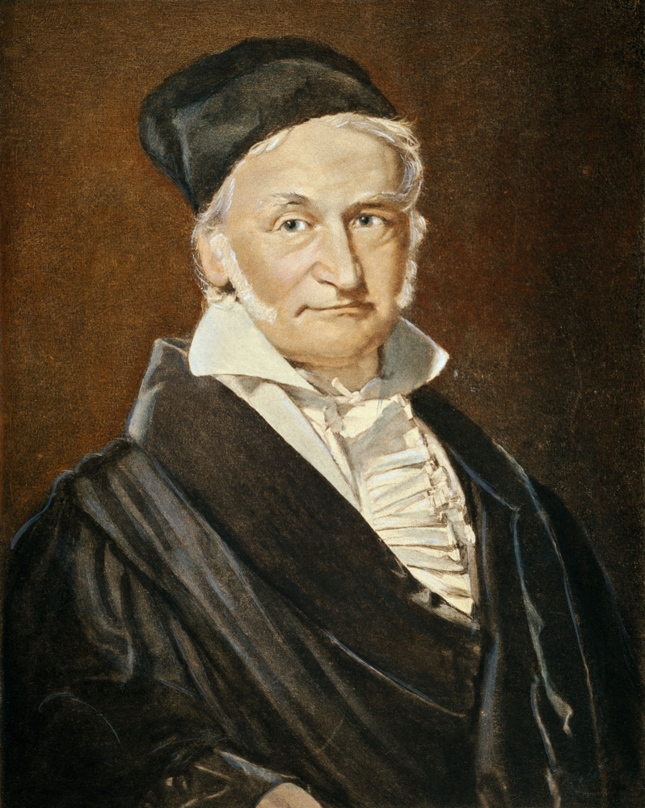

```{r setup, include=FALSE}
knitr::opts_chunk$set(echo = TRUE)
```

## R Markdown

```{r}
# sample of size 100
Y<- rnorm( 100)
hist( Y)
```

Karl Frederick Gauss was a very influential mathematician.
{width=30%}
